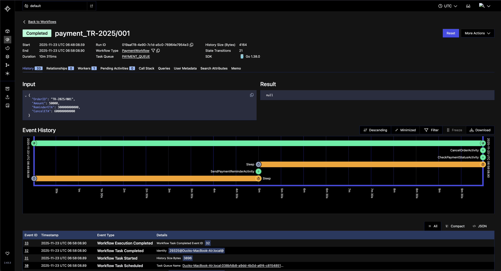

# PoC Temporal Workflow

### Quick
1. Run service 
    ```sh
    $ go run cmd/worker/main.go
    $ go run cmd/api/main.go 
    ```
2. Test endpoint
     ```sh
    $ curl -X POST http://localhost:8081/checkout \
        -H "Content-Type: application/json" \
        -d '{"order_id":"TR-2025/001", "amount":50000}'
    ```
3. Result Worker
    ```sh
    $ go run cmd/worker/main.go
    19aaf9b-3d6b-7b6c-bc7d-2d18b1f48656 Attempt 1 orderId TR-2025/001
    2025/11/23 14:26:17 INFO  Waiting until reminder ETA Namespace default TaskQueue PAYMENT_QUEUE WorkerID 33718@Ducks-MacBook-Air.local@ WorkflowType PaymentWorkflow WorkflowID payment_TR-2025/001 RunID 019aaf9b-3d6b-7b6c-bc7d-2d18b1f48656 Attempt 1 ETA 5m0s
    2025/11/23 14:26:17 DEBUG NewTimer Namespace default TaskQueue PAYMENT_QUEUE WorkerID 33718@Ducks-MacBook-Air.local@ WorkflowType PaymentWorkflow WorkflowID payment_TR-2025/001 RunID 019aaf9b-3d6b-7b6c-bc7d-2d18b1f48656 Attempt 1 TimerID 5 Duration 5m0s
    2025/11/23 14:31:18 DEBUG ExecuteActivity Namespace default TaskQueue PAYMENT_QUEUE WorkerID 33718@Ducks-MacBook-Air.local@ WorkflowType PaymentWorkflow WorkflowID payment_TR-2025/001 RunID 019aaf9b-3d6b-7b6c-bc7d-2d18b1f48656 Attempt 1 ActivityID 10 ActivityType SendPaymentReminderActivity
    Push notif reminder:  TR-2025/001 --> [SendPaymentReminderActivity]
    2025/11/23 14:31:18 INFO  Waiting until cancel ETA Namespace default TaskQueue PAYMENT_QUEUE WorkerID 33718@Ducks-MacBook-Air.local@ WorkflowType PaymentWorkflow WorkflowID payment_TR-2025/001 RunID 019aaf9b-3d6b-7b6c-bc7d-2d18b1f48656 Attempt 1 ETA 5m0s
    2025/11/23 14:31:18 DEBUG NewTimer Namespace default TaskQueue PAYMENT_QUEUE WorkerID 33718@Ducks-MacBook-Air.local@ WorkflowType PaymentWorkflow WorkflowID payment_TR-2025/001 RunID 019aaf9b-3d6b-7b6c-bc7d-2d18b1f48656 Attempt 1 TimerID 16 Duration 5m0s
    2025/11/23 14:36:18 DEBUG ExecuteActivity Namespace default TaskQueue PAYMENT_QUEUE WorkerID 33718@Ducks-MacBook-Air.local@ WorkflowType PaymentWorkflow WorkflowID payment_TR-2025/001 RunID 019aaf9b-3d6b-7b6c-bc7d-2d18b1f48656 Attempt 1 ActivityID 21 ActivityType CheckPaymentStatusActivity
    Check payment status:  TR-2025/001 --> [CheckPaymentStatusActivity]
    2025/11/23 14:36:18 INFO  Payment not completed. Cancelling order Namespace default TaskQueue PAYMENT_QUEUE WorkerID 33718@Ducks-MacBook-Air.local@ WorkflowType PaymentWorkflow WorkflowID payment_TR-2025/001 RunID 019aaf9b-3d6b-7b6c-bc7d-2d18b1f48656 Attempt 1
    2025/11/23 14:36:18 DEBUG ExecuteActivity Namespace default TaskQueue PAYMENT_QUEUE WorkerID 33718@Ducks-MacBook-Air.local@ WorkflowType PaymentWorkflow WorkflowID payment_TR-2025/001 RunID 019aaf9b-3d6b-7b6c-bc7d-2d18b1f48656 Attempt 1 ActivityID 27 ActivityType CancelOrderActivity
    Push notif cancel order :  TR-2025/001 --> [CancelOrderActivity]
    ```
3. Result Temporal
    
